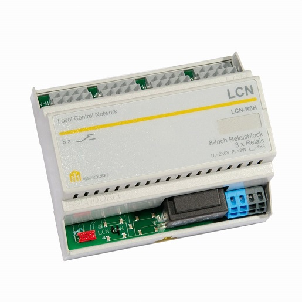

# LCNSerial Binding


This binding provides support for an LCN-Bussystem - with a serial interface LCN-PK (or maybe LCN- PKU? )
The binding ist tested on a Windows10-PC and a Raspberry-Pi using a LCN-PK Modul with a USB-Serial cable. 
The serial-Port can be configured with the Thing configuration.


In this first release, all Things (LCN-Modules) must use the same COM-Port.

## Supported Things

The binding defines a single thing type called `lcnActor`.

An lcnActor requires the single configuration parameter `port`, which specifies the serial port that should be used. 

The only available channel is a `SYSTEM_RAWBUTTON` channel called `button`, which emits `PRESSED` events (no `RELEASED` events though) whenever data is available on the serial port (which will be read and discarded).

The use case is simple: Connect any push button to pins 2 and 7 of an RS-232 interface as short-cutting those will signal that data is available.
Using the default toggle profile, this means that you can use this channel to toggle any Switch item through the button.

### Configuration

The configuration for the `LCNSerial` consists of the following parameters:

| Parameter            | Type    | Description                                                                                         |
|----------------------|---------|-----------------------------------------------------------------------------------------------------|
| port                 | String  | The serial port where the P1-port is connected to.   (e.g. Linux: `/dev/ttyUSB1`, Windows: `COM2`)  |
| lcn_id               |  int    | LCN-Adress of the LCN-Module                                                                        |
| Shutter1_enabled     | boolean |              tbd                                                                                    |
| Shutter1_drivetime   | int     |              tbd                                                                                    | | Shutter1_overalltime | int     |              tbd                                                                                    | 
| Shutter2_enabled     | boolean |              tbd                                                                                    |
| Shutter2_drivetime   | int     |              tbd                                                                                    | | Shutter2_overalltime | int     |              tbd                                                                                    | | Shutter3_enabled     | boolean |              tbd                                                                                    |
| Shutter3_drivetime   | int     |              tbd                                                                                    | | Shutter3_overalltime | int     |              tbd                                                                                    |
| Shutter4_enabled     | boolean |              tbd                                                                                    |
| Shutter4_drivetime   | int     |              tbd                                                                                    | | Shutter4_overalltime | int     |              tbd                                                                                    | 


## Channels

| Channel       | Type          | Description                |
| ------------- |---------------|--------------------------- |
| Output1       | Dimmer        |              tbd           |
| Output2       | Dimmer        |              tbd           |
| Relais_Bit1   | Switch        |              tbd           |
| Relais_Bit2   | Switch        |              tbd           |
| Relais_Bit3   | Switch        |              tbd           |
| Relais_Bit4   | Switch        |              tbd           |
| Relais_Bit5   | Switch        |              tbd           |
| Relais_Bit6   | Switch        |              tbd           |
| Relais_Bit7   | Switch        |              tbd           |
| Relais_Bit8   | Switch        |              tbd           |
| Shutter1      | Rollershutter |              tbd           |
| Shutter2      | Rollershutter |              tbd           |
| Shutter3      | Rollershutter |              tbd           |
| Shutter4      | Rollershutter |              tbd           |

## Configuration Paper-UI


## Usage of rollershutters


## Full Example

demo.things:

```
TBD
```

demo.items:

```
TBD
```

_Note:_ This is a trigger channel, so you will most likely bind a second (state) channel to your item, which will control your physical light, so you might end up with the following, if you want to use your button with a Hue bulb:

```
TBD
```

demo.sitemap:

```
sitemap demo label="Main Menu"
{
    Frame {
        TBD
    }
}
```
